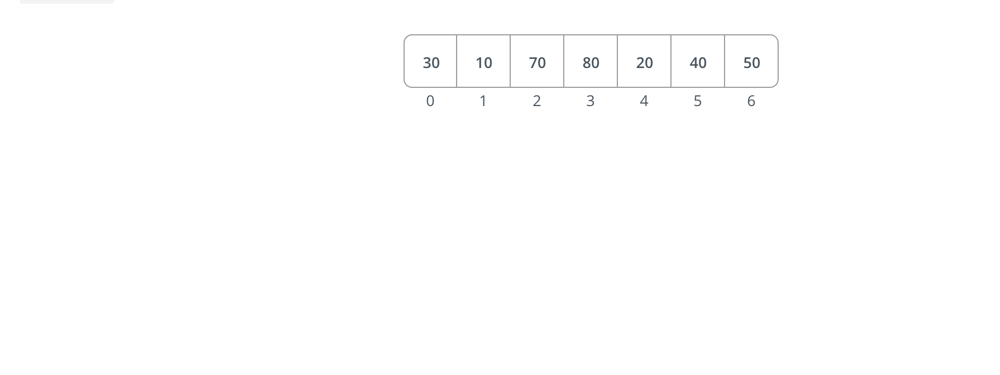

### The **Merge Sort** Algorithm


# Helpful Pre-Knowledge...
**Recursion**

The **Merge Sort** algorithm sorts arrays using *recursion*.  Recursion is a process in which a function is resolved when a specific condition is met by the reptition of an inner function.

**Time Complexity**
Calculating and understanding the time complexity of an algorthim is beneficial, because **Merge Sort** has time complexity advantages and constraints, which will be explained below.


# What is the **Merge Sort** algorithm?
**Merge Sort** is a sorting algorithim that sorts an array recursively, by dividing an array into evenly/semi-evenly split subrrays, by sorting those smaller subarrays, then merging the sorted subarrays back into a single, final sorted array.   


# What does the **Merge Sort** algorithm look like?
Visually, the **Merge Sort** algorithim exemplifies a divide and conquer method.  


If wwe start with an array of eight elements, the first divide will result in a subarray level with two arrays of four elements.  The next level of divison will result in four subarrys of two elements.  The divsion stops after all subarrays have been divded down to single element arrays. 

Did you notice how the divisions do *not* ocurr simultaneously?  This is important to recall when you see the recursive nature of the code. The **Merge Sort** algorithm "divides and conquers" the leftmost array, to completion, before proceeding to handling the next subarray.  A subarray is not considered "conquered" (or resolved) until the values of the subarrays beneath it have been sorted in ascending order, and emptied into the array at hand.

Note: If an array has an odd number of elements (meaning it won't divide evenly), one of the subarryas will have 1 more element than the other.  This will be reflected in the code below.



After the merging of subarrays has resolved to two separately sorted arrays, the final merge sort can take place.  Starting with the leftmost elements of each array (index 0), the two elements are compared as we've previously seen demonstrated.  The lowest value is assigned to the first position of the final array. 

Note... The comparison will always occur between the leftmost values of each subarrays.  This means if the index 0 of the left and right arrays are compared resulting in the left array's index 0 as the lower value, it will be placed into the index 0 of the main array.  And the next round of comparisons will be between index 1 of the left array, and index 0 of the right array.  This comaprison continues until both subarrays are emppty, resulting in a completely sorted array. 


 

# How do you use **Merge Sort**?

1. Create a base condition, where an array returns, once it has reached a length of 1.
```if (array.length === 1) {
	return array;
}
```


2. Divide the input array into two subarrays.
```
const middleIndexValue = Math.ceil(array.length/2);
const leftArray = array.slice(0, middleIndexValue);
const rightArray = array.slice(middleIndexValue);
```

3. A while loop compares the values of the left index and the right index.  Taking the lesser of the two, and placing it into 

```
while (leftIndex < leftArray.length && rightIndex < rightArray.length) {
	if (leftArray[leftIndex] < rightArray[rightIndex]) {
		mergedValues.push(leftArray[leftIndex]);
		leftIndex++;
	} else {
		mergedValues.push(rightArray[rightIndex]);
		rightIndex++;
	}
}
```


4. Eventually one of the arrays will be completely empty, as seen in the image below.
  


Since our helper fucntion only runs when both arrays have lengths greater than 0, this return uses the concat method to merge the remaining subarray of sorted values, with the higher array.
```
return mergedValues.concat(leftArray.slice(leftIndex)).concat(rightArray.slice(rightIndex));
```


The function continues to run for the remaining subarrays.


5. The function is resolved when the last subarrays have been sorted into the main array.
```
return mergeTwoSubArrays(createSubArrays(leftArray), createSubArrays(rightArray));
```


# When is it best to use **Merge Sort**?
1) Merge sort is best used when you have to sort a large set of data.
2) Linked lists, which are chain-like data structures where each element (called a node) holds the value itself, and the node that follows it.


# Why would you use **Merge Sort**?
**Merge sort** has a **log-linear** time compelxity O(n log(n)).  

If you reference the time complexity graph, you will see that for small data sets, As demonstrated by the time complexity graph, as the data size increases, the number of operations stays relatively the same

Every divison of an array is a logarithmic function, O(log(n)), as shown below.


The merging of arrays is linear, O(n), because there is one operation needed for every array that has been created, as shown below.


Therefore...
*Linear* O(n) * *Logarithmic* O(log n) = **O((n)log(n))**


# Key Takeaways

**Merge Sort** is:

## **Stable!**
A stable sorting algorithm, which means it maintains the relative order of equal elements in the input array.

## **Speedy!**
Faster than insertion, bubble, and selection sort... However, **Merge Sort** has a higher time complexity which can result in slower performance when used for small datasets which could be more efficently sorted with other methods.

## **Super-Size Friendly & Space Hogging!**
Performs well on large datasets... but requires additional memory to temporarily store the merged sub-arrays created during the sorting process. 

##### Research & Sources
1) *DevSage* - **Best Javascript Recursion Explanation on YouTube** - https://www.youtube.com/watch?v=LteNqj4DFD8
2) *BroCode* - "**Learn Merge Sort in 13 Minutes**" - https://www.youtube.com/watch?v=3j0SWDX4AtU | **Learn Big O Notation in 6 Minutes** https://youtu.be/XMUe3zFhM5c?si=23ki_qgq6UNI40c7
3) *GeeksForGeeks* - **"Calculating Time Complexity | Data Structures and Algorithms"** - https://www.youtube.com/watch?v=KXAbAa1mieU
4) *Kantan Coding* - **Big O Notation Series #9: Understanding Merge Sort** - https://youtu.be/HrCPqJHQSxY?si=6kRlRT0c3SLS1Zt2
5) https://www.hackerearth.com/practice/algorithms/sorting/merge-sort/visualize/
6) https://www.geeksforgeeks.org/merge-sort/
7) https://www.studytonight.com/data-structures/merge-sort
